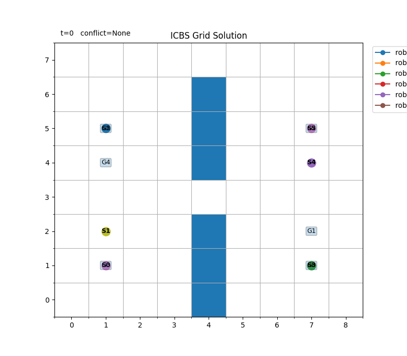

# mapf_lab

A modular Python framework for testing multi-robot path planning algorithms,
including CBS, db-CBS, and future variants.

## Setup

```bash
python3 -m venv .venv
source .venv/bin/activate
python -m pip install --upgrade pip
pip install -r requirements.txt
pip install -r requirements-dev.txt
```

## Run

```bash
PYTHONPATH=src python -m mapf_lab.main                       # sanity check
PYTHONPATH=src python -m mapf_lab.experiments.benchmark      # benchmarking
PYTHONPATH=src python -m tests.cbs_test                      # CBS  Test
PYTHONPATH=src python -m tests.icbs_test                     # ICBS Test
```

## Algorithm Status

| Algorithm | Level | Status | Entry / File | Notes |
| --- | --- | --- | --- | --- |
| A* (GridAStarPlanner) | Low-level | Implemented | `src/mapf_lab/planners/low_level/astar.py` | Used by CBS for single-agent replanning. |
| CBS (Conflict-Based Search) | High-level | Implemented | `src/mapf_lab/planners/cbs/planner.py` | CBS currently used in `tests/cbs_test.py`. |
| ICBS (Conflict-Based Search) | High-level | Implemented | `src/mapf_lab/planners/icbs/planner.py` | ICBS currently tested in `tests/icbs_test.py`. |
| db-CBS | High-level | Planned (placeholder) | `src/mapf_lab/planners/dbcbs/__init__.py` | Package exists but no planner implementation yet. |
<!-- | _Add new algorithm here_ | _High-level / Low-level_ | _Planned / In Progress / Implemented_ | `src/mapf_lab/planners/...` | _Keep one algorithm per row for easy tracking._ | -->

## CBS Demo

CBS animation output is saved in `outputs` and shown below.

- File link: [`outputs/cbs_demo.gif`](outputs/cbs_demo.gif)


## ICBS Demo

ICBS animation output is saved in `outputs` and shown below.

- File link: [`outputs/icbs_demo.gif`](outputs/icbs_demo.gif)

